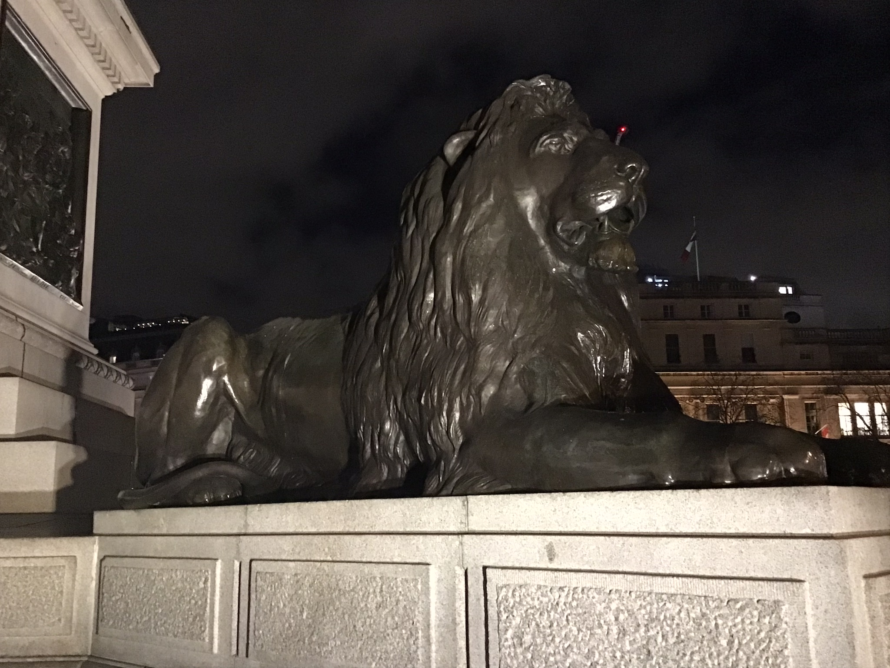

## INTRODUCTION

These 2 lion head drawings were both drawn by my me      
whilst on a visit to the National Gallery in Trafalgar Square, London, UK.      

When the gallery had closed down at 6 PM during the evening;           
I decided to go off and walk around the square for a bit...in order to see more.  
    
After staring up at the 4 x magnificent lion sculptures that lie around the square...;       
I thought why not have a go at drawing one or two of these.   

-----

-----

**NOTE(S)**:-   

1. I've always been a *fervent* art lover all throughout my life...;         
so, will often go and visit seeing the National Gallery, regularly.       

2. The night lion photo was taken by me at Trafalgar Square...using the iPad Air 2/Built-in camera app.  

3. Both lion head drawings were made using my finger:-   
Hardware: **iPad Air 2**  
App: **Zen Brush**      

-----

## Links  

The National Gallery  
- https://www.nationalgallery.org.uk/  

-----

## Other

-(**NOTE**: I found: 'tomcam.github.io' page(s)...;  
when I was trying to figure out how to add graphics to Github pages...?  
    
I also noticed he has quite a lot of extemely well written info. inside of his pages;   
so, I decided to include a few links here.)-    

- https://tomcam.github.io/  
- https://tomcam.github.io/least-github-pages/  
- https://tomcam.github.io/least-github-pages/adding-images-github-pages-site.html  
- https://tomcam.github.io/spectre-book/  
- https://vuepressbook.com/  
- https://vuepressbook.com/introduction.html#who-s-the-audience-for-vuepress  

